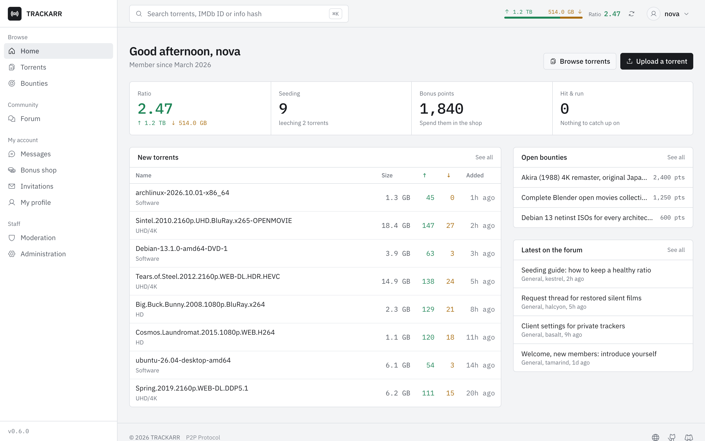
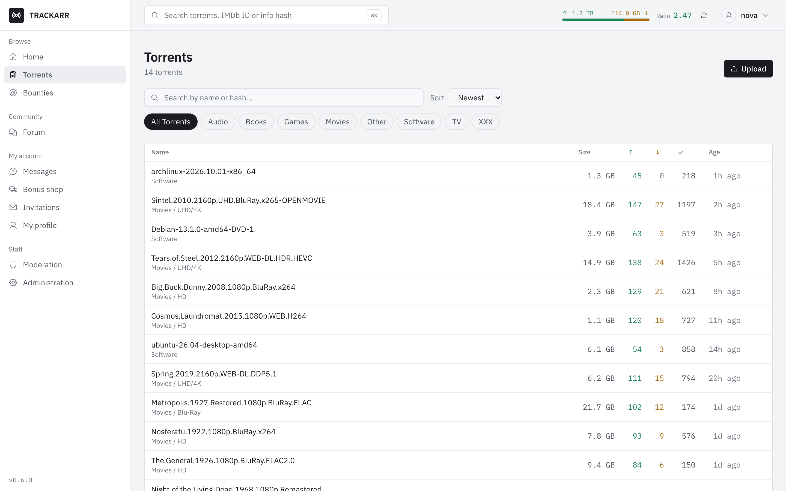
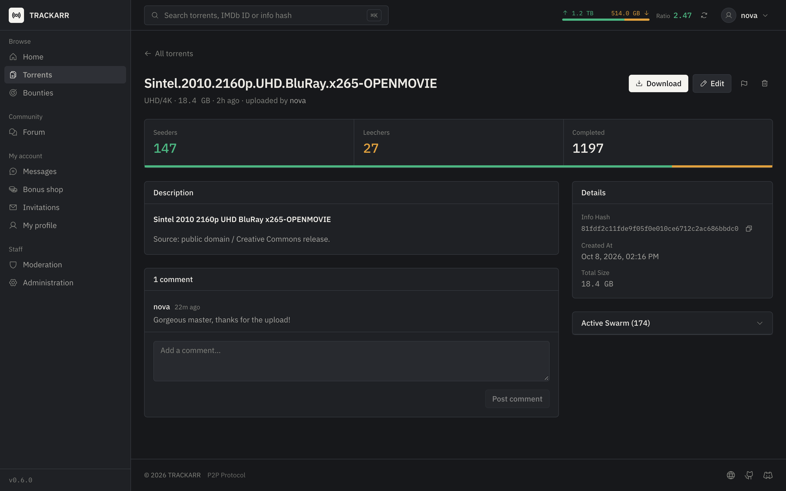
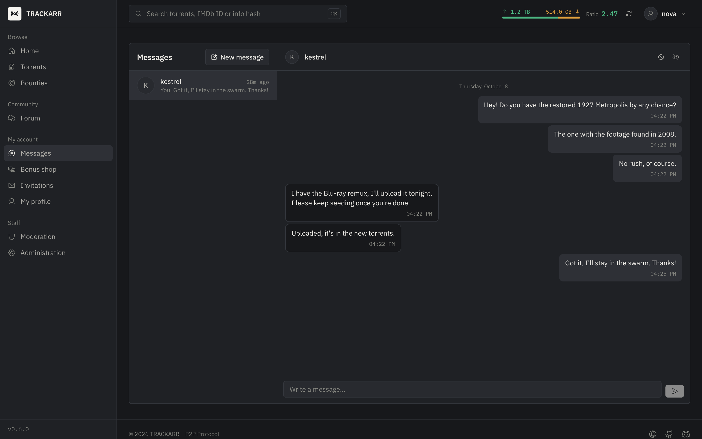
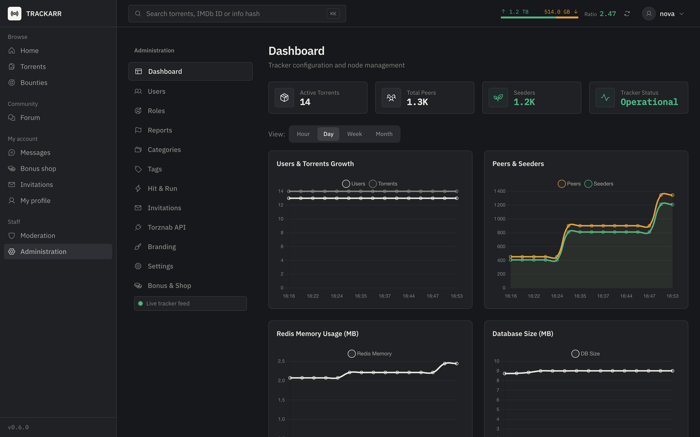
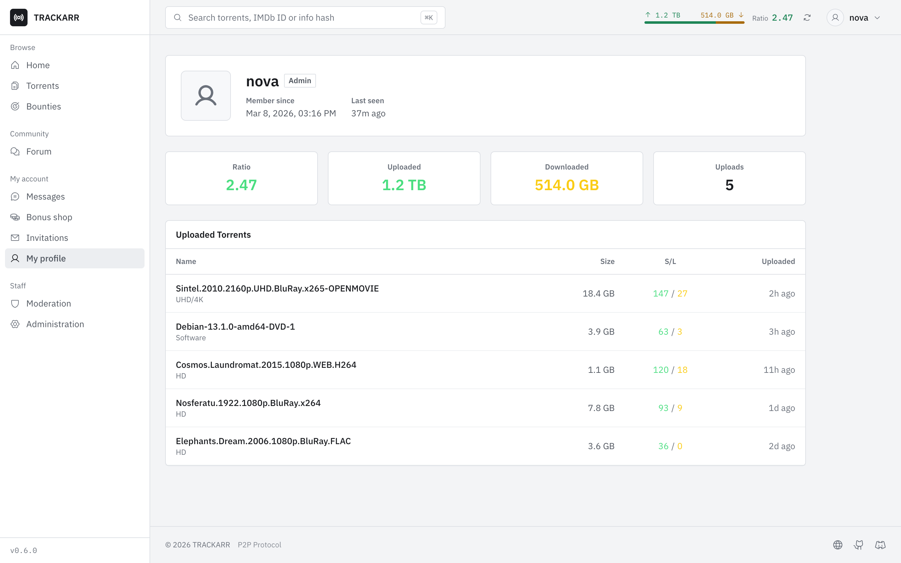

<div align="center">

# 🌐 Trackarr

**A modern, high-performance private BitTorrent tracker**

Built with Nuxt 4 • PostgreSQL • Redis

[](https://nodejs.org/)
[](https://nuxt.com/)
[](https://www.typescriptlang.org/)
[](LICENSE)
[](https://discord.gg/bbbkCPkdRk)

[Features](#-features) • [Quick Start](#-quick-start) • [Security](#-security-architecture) • [Documentation](https://florianjs.github.io/trackarr/) • [Live Demo](https://tracker.florianargaud.com/) • [Discord](https://discord.gg/bbbkCPkdRk)

<picture>
  <source media="(prefers-color-scheme: dark)" srcset="public/images/dashboard.png">
  
</picture>

</div>

---

## ✨ Features

| **Privacy & Authentication**        | **Performance**                   |
| ----------------------------------- | --------------------------------- |
| Zero-Knowledge Authentication       | Redis-powered sub-ms peer lookups |
| Proof of Work anti-abuse            | PostgreSQL with full-text search  |
| Private torrents (DHT/PEX disabled) | HTTP announce with passkeys       |
| Ratio tracking & enforcement        | Optimized for high concurrency    |

| **Community**                                 | **Automation**                                      |
| --------------------------------------------- | --------------------------------------------------- |
| Bonus points earned by seeding & uploading    | Torznab API for Prowlarr, Sonarr & Radarr           |
| Bonus shop (upload credit, invites, avatars)  | IMDb / TMDb / TheTVDB IDs with ID-based search      |
| Bounties: request torrents with a points pot  | Personal RSS feeds                                  |
| Global freeleech (timed or open-ended)        | Torrent moderation queue                            |
| Forum, comments, reports, invitations, H&R    | English & French UI (more languages welcome)        |
| Private messages between members, with blocks | Light & dark themes, ⌘K command palette             |

| **Security**                     | **Emergency**                                |
| -------------------------------- | -------------------------------------------- |
| Distributed rate limiting        | **Panic Mode** — Instant database encryption |
| Auto IP blacklisting             | AES-256-GCM protected data                   |
| Sanitized user content (XSS)     | Full restoration with the panic password     |
| Hashed peer IPs in logs & stats  | Unrecoverable without password               |

---

## 🔐 Security Architecture

### Zero-Knowledge Authentication (ZKE)

Trackarr uses a **Zero-Knowledge** authentication system: the server **never sees or stores your password**. All cryptographic operations happen client-side.

```
┌─────────────────────────────────────────────────────────────────────┐
│                        REGISTRATION FLOW                            │
├─────────────────────────────────────────────────────────────────────┤
│                                                                     │
│  ┌─────────────┐                              ┌─────────────────┐  │
│  │   CLIENT    │                              │     SERVER      │  │
│  └──────┬──────┘                              └────────┬────────┘  │
│         │                                              │           │
│         │ 1. Solve PoW Challenge (anti-spam)           │           │
│         │ ◄────────────────────────────────────────────┤           │
│         │                                              │           │
│         │ 2. Generate random salt (32 bytes)           │           │
│         │ 3. Derive key = PBKDF2(password, salt)       │           │
│         │ 4. Compute verifier = SHA256(key)            │           │
│         │                                              │           │
│         │ 5. Send {username, salt, verifier} ─────────►│           │
│         │    Password NEVER leaves client           │           │
│         │                                              │           │
│         │                              6. Store salt + │           │
│         │                                 verifier     │           │
│         │                              7. Create session           │
│         │ ◄──────────────────────────────── 8. OK ─────┤           │
│                                                                     │
└─────────────────────────────────────────────────────────────────────┘

┌─────────────────────────────────────────────────────────────────────┐
│                          LOGIN FLOW                                 │
├─────────────────────────────────────────────────────────────────────┤
│                                                                     │
│  ┌─────────────┐                              ┌─────────────────┐  │
│  │   CLIENT    │                              │     SERVER      │  │
│  └──────┬──────┘                              └────────┬────────┘  │
│         │                                              │           │
│         │ 1. Request challenge ───────────────────────►│           │
│         │                                              │           │
│         │ ◄──────── 2. Return {salt, challenge} ───────┤           │
│         │                                              │           │
│         │ 3. Derive key = PBKDF2(password, salt)       │           │
│         │ 4. Compute verifier = SHA256(key)            │           │
│         │ 5. Generate proof = SHA256(verifier+challenge)           │
│         │                                              │           │
│         │ 6. Send {username, proof, challenge} ───────►│           │
│         │    Password NEVER leaves client           │           │
│         │                                              │           │
│         │                       7. Compute expected =  │           │
│         │                          SHA256(storedVerifier+challenge)│
│         │                       8. Verify proof == expected        │
│         │ ◄──────────────────────────────── 9. Session ┤           │
│                                                                     │
└─────────────────────────────────────────────────────────────────────┘
```

**Key Properties:**

- **Password never transmitted** — Only cryptographic proofs
- **PBKDF2 with 100k iterations** — Brute-force resistant
- **Unique, single-use challenge per login** — Prevents replay attacks
- **Proof of Work** — Stops automated registration attacks

> **Limitation**: the stored verifier is enough to compute a valid proof. Someone who obtains a copy of the database can log in as any user without knowing their password, so database backups must be protected like password files. Moving to a PAKE (SRP / OPAQUE) is planned.

---

### 🚨 Panic Mode (Emergency Encryption)

The **Panic Button** allows administrators to **instantly encrypt all sensitive data** in an emergency. Once activated, all torrent files become unusable and user data is unreadable.

```
┌───────────────────────────────────────────────────────────────────┐
│                       NORMAL STATE                                │
│  • Torrents downloadable                                          │
│  • User data readable                                             │
│  • Posts & comments visible                                       │
└───────────────────────────────────────────────────────────────────┘
                              │
                    PANIC ACTIVATED
                              │
                              ▼
┌───────────────────────────────────────────────────────────────────┐
│                      ENCRYPTED STATE                              │
│  • .torrent files → AES-256-GCM encrypted (unusable)              │
│  • Torrent names  → [ENCRYPTED]                                   │
│  • Torrent sizes  → 0                                             │
│  • User credentials → Encrypted                                   │
│  • Forum posts    → Encrypted                                     │
└───────────────────────────────────────────────────────────────────┘
                              │
                    RESTORE (with password)
                              │
                              ▼
┌───────────────────────────────────────────────────────────────────┐
│                       RESTORED STATE                              │
│  All data restored to original state                              │
└───────────────────────────────────────────────────────────────────┘
```

**How it works:**

1. **First admin** sets a **Panic Password** during registration (min. 12 chars)
2. Only a hash of the panic password is stored, never the password itself
3. **Activation**: Admin → Settings → Panic → confirm and enter the Panic Password
4. **Restoration**: enter the Panic Password (works without being logged in, rate limited)

The encryption key is derived from the panic password itself, so the database alone is not enough to decrypt the data. Encryption and restoration each run in a single transaction: a failure leaves the database unchanged.

**Encryption details:**
| Component | Algorithm |
|-----------|-----------|
| Key Derivation | scrypt (32 bytes) from the panic password, random salt |
| Encryption | AES-256-GCM |
| IV | 12 bytes random, unique per encrypted value |

> **WARNING**: Without the Panic Password, encrypted data is **permanently lost**. There is no recovery mechanism.

---

## 🚀 Quick Start

### Prerequisites

- **Node.js** 22+ • **Docker** & Docker Compose • **npm**

#### DNS Configuration (Required before installation)

> **IMPORTANT**: Before running the installer, you must configure your DNS records to point to your VPS IP address.

Create the following **A records** pointing to your server's IP:

| Subdomain                    | Record Type | Value       |
| ---------------------------- | ----------- | ----------- |
| `tracker.your-domain.com`    | A           | Your VPS IP |
| `announce.your-domain.com`   | A           | Your VPS IP |
| `monitoring.your-domain.com` | A           | Your VPS IP |

> **Note**: DNS propagation can take up to 24-48 hours, but usually completes within a few minutes. The installer will fail to obtain SSL certificates if DNS is not properly configured.

### Option 1: Automated Installation (Recommended)

> **Best for production deployments.** Handles dependencies, secrets, SSL, and systemd automatically.

```bash
# Download and run the installer
curl -fsSL https://raw.githubusercontent.com/florianjs/trackarr/main/scripts/install.sh -o install.sh
chmod +x install.sh
sudo ./install.sh
```

The installer will:

- Install Docker and dependencies
- Generate cryptographic secrets
- Configure firewall rules
- Set up TLS/SSL with Let's Encrypt
- Create systemd service for auto-restart
- Configure PostgreSQL, Redis, Caddy, and monitoring
- Set up Prometheus + Grafana monitoring

> **Monitoring**: After installation, Grafana is accessible at `https://monitoring.your-domain.com/grafana`
>
> Credentials: user `admin`, with a random password generated by the installer (shown at the end of the install, saved in `CREDENTIALS.txt` and as `GRAFANA_ADMIN_PASSWORD` in `.env`).
> Lost it? Reset it with:

```bash
cd /opt/trackarr
docker exec -it trackarr-grafana grafana cli admin reset-admin-password <new-password>
```


### Option 2: Development with Docker

> PostgreSQL is published on `127.0.0.1:5432` only (not reachable from other machines). Without `IP_HASH_SECRET`, development uses a random secret per process.

```bash
# Clone repository
git clone https://github.com/florianjs/trackarr.git && cd trackarr
cp .env.example .env

# Start all services (app + postgres + redis)
docker compose up -d

# View logs
docker compose logs -f app
```

**Open [http://localhost:3000](http://localhost:3000)**




---

## 🔒 Security

> **For production, always use the install script** to ensure proper secret generation and security configuration.

### Key Security Features

| Layer              | Protection                                                 |
| ------------------ | ---------------------------------------------------------- |
| **Authentication** | ZKE, PoW anti-abuse, sealed sessions (7 days), SameSite cookies, roles checked in DB on every request |
| **Database**       | SCRAM-SHA-256 auth, TLS, prepared statements, pool limits  |
| **Redis**          | Password auth, command restrictions, memory limits         |
| **Network**        | Rate limiting, auto IP bans, proxy headers trusted only from `TRUSTED_PROXIES` |
| **Content**        | Sanitized Markdown & rich text, sandboxed uploads, passkey-protected RSS & scrape |
| **Privacy**        | Hashed IPs in peer stats & logs, passkeys stripped from access logs. The last login IP is kept per user for IP bans, and peer IPs live in Redis while a peer is active. |

### Rate Limits

| Endpoint   | Limit   | Ban on Abuse                    |
| ---------- | ------- | ------------------------------- |
| Public API   | 100/min  | 100+ req/10s → auto-block       |
| Mutations    | 10/min   | Progressive penalties           |
| Login        | 10/5min  | Temporary block, no blacklist   |
| Registration | 5/5min   | IP blacklisted after violations |
| Panic restore| 5/5min   | IP blacklisted after violations |
| Tracker      | 200/min  | Distributed sliding window      |

### Production Security Checklist

**Use `install.sh`** — it handles security automatically:

- Generates cryptographic secrets (32-64 chars)
- Configures TLS for all connections
- Sets up Caddy reverse proxy with HTTPS
- Configures firewall (ports 80, 443 only)
- Network isolation (databases not exposed)

**Manual steps after install:**

- [ ] Set up automated PostgreSQL backups

---

## 🏗️ Tech Stack

| Layer    | Technology                          | Purpose                             |
| -------- | ----------------------------------- | ----------------------------------- |
| Frontend | Nuxt 4, Vue 3, Tailwind CSS         | SSR, Composition API                |
| i18n     | @nuxtjs/i18n                        | English & French UI                 |
| Backend  | Nitro Server Engine                 | API routes, middleware              |
| Database | PostgreSQL 16 + Drizzle ORM         | Data persistence, full-text search  |
| Cache    | Redis 7                             | Peer lists, sessions, rate limiting |
| P2P      | bittorrent-tracker                  | HTTP announces (UDP & WebSocket disabled) |
| Crypto   | Web Crypto API, scrypt, AES-256-GCM | ZKE auth, Panic encryption          |
| Monitor  | Prometheus + Grafana                | Metrics, dashboards, alerting       |

---

## 🐳 Docker Commands

```bash
docker compose up -d              # Start services
docker compose down               # Stop services
docker compose logs -f            # View logs
docker compose down -v            # Stop + remove volumes
```

### Health Checks

```bash
docker exec trackarr-db pg_isready           # PostgreSQL
docker exec trackarr-redis redis-cli ping    # Redis
```

### Updating

To update your Trackarr installation to the latest version:

```bash
cd /opt/trackarr
git checkout main
git pull origin main
docker compose -f docker-compose.prod.yml down
docker compose -f docker-compose.prod.yml up -d --build
```

> **Note**: This will rebuild the containers with the latest code. Your data (PostgreSQL, Redis) is persisted in Docker volumes and will not be affected. Schema changes are applied automatically at startup.
>
> **Upgrading from 0.5.x to 0.6.x?** Follow the steps in the [v0.6.0 release notes](https://github.com/florianjs/trackarr/releases/tag/v0.6.0) (rotate `NUXT_SESSION_PASSWORD`, new required secrets, RSS now needs a passkey).

### Troubleshooting

**Full restart (stop and start all services):**

```bash
cd /opt/trackarr
docker compose -f docker-compose.prod.yml down
docker compose -f docker-compose.prod.yml up -d
```

**Full restart with rebuild (if you suspect issues with cached images):**

```bash
cd /opt/trackarr
docker compose -f docker-compose.prod.yml down
docker compose -f docker-compose.prod.yml up -d --build --force-recreate
```

**View logs to debug issues:**

```bash
docker compose -f docker-compose.prod.yml logs -f
docker compose -f docker-compose.prod.yml logs -f app  # App only
```

---

## 🧪 Development

```bash
npm run dev              # Start dev server (HMR)
npm run build            # Production build
npm test                 # Unit & security tests (Vitest)
npx drizzle-kit push     # Push schema changes
npx drizzle-kit studio   # Database GUI
```

**Translations**: strings live in `i18n/locales/<code>/*.json`. To add a language, copy `i18n/locales/en/`, translate it, and declare the locale in `nuxt.config.ts` (`i18n.locales`).

| Private messages | Admin dashboard |
| --- | --- |
|  |  |



---

## 🤝 Contributing

1. Fork the repository
2. Create feature branch (`git checkout -b feature/amazing`)
3. Commit changes (`git commit -m 'Add amazing feature'`)
4. Push to branch (`git push origin feature/amazing`)
5. Open a Pull Request

---

## 🙏 Acknowledgements

Trackarr is built on the shoulders of giants. We'd like to thank the following open source projects:

| Project                                                                | Role                        |
| ---------------------------------------------------------------------- | --------------------------- |
| [Nuxt](https://nuxt.com)                                               | Fullstack Vue framework     |
| [Vue.js](https://vuejs.org)                                            | Reactive frontend framework |
| [bittorrent-tracker](https://github.com/webtorrent/bittorrent-tracker) | BitTorrent tracker library  |
| [Drizzle ORM](https://orm.drizzle.team)                                | TypeScript ORM              |
| [PostgreSQL](https://www.postgresql.org)                               | Database                    |
| [Redis](https://redis.io)                                              | In-memory cache             |
| [ioredis](https://github.com/redis/ioredis)                            | Redis client for Node.js    |
| [Tailwind CSS](https://tailwindcss.com)                                | Utility-first CSS           |
| [Chart.js](https://www.chartjs.org)                                    | Charts & visualizations     |
| [Prometheus](https://prometheus.io)                                    | Metrics collection          |
| [Grafana](https://grafana.com)                                         | Monitoring dashboards       |
| [VitePress](https://vitepress.dev)                                     | Documentation framework     |
| [Vitest](https://vitest.dev)                                           | Testing framework           |
| [Pinia](https://pinia.vuejs.org)                                       | State management            |
| [Zod](https://zod.dev)                                                 | Schema validation           |
| [Nuxt i18n](https://i18n.nuxtjs.org)                                   | Internationalization        |
| [DOMPurify](https://github.com/cure53/DOMPurify)                       | HTML sanitization           |
| [sanitize-html](https://github.com/apostrophecms/sanitize-html)        | Server-side HTML sanitization |

---

<!-- CONTRIBUTORS:START -->

## 👥 Contributors

Thanks to all our contributors! Sorted by number of commits.

|                                                      Avatar                                                       | Contributor                             | Commits |
| :---------------------------------------------------------------------------------------------------------------: | --------------------------------------- | :-----: |
|  | **[Dim145](https://github.com/Dim145)** |    4    |
|  | **[IkiaeM](https://github.com/IkiaeM)** |    4    |

<!-- CONTRIBUTORS:END -->

---

## 📄 License

MIT License — see [LICENSE](LICENSE) for details.

---

<div align="center">

**Built with ❤️ for the P2P community**

[Back to top](#-trackarr)

</div>
